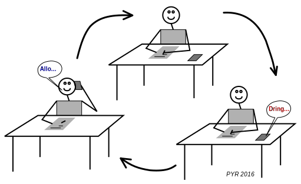

<!-- DIAPORAMA -->

<!-- Page de titre -->
<section class="page_de_garde">

Systèmes embarqués

Introduction aux interruptions

Pierre-Yves Rochat

</section>

<!-- Page bienvenue plein écran-->
<section>
<h1 class="en_tete">Introduction aux interruptions</h1>
<!-- def A -->
<!-- def A -->
<!-- def A -->

<!-- def A -->Systèmes embarqués | **Introduction aux interruptions**
<!-- def A -->

<!-- A -->

Pierre-Yves Rochat

</section>

<section>
<!-- A -->
<h1 class="en_tete">Motivation des interruptions</h1>

De manière générale un microcontrôleur doit être programmé pour :

<!-- 234567 -->

<!-- 234567 -->* détecter des changements sur ses entrées
<!-- 34567 -->* agir en conséquence sur ses sorties
<!-- 234567 -->

<!-- 4567 -->

<!-- 4567 -->On constate que :
<!-- 4567 -->

<!-- 567 -->

<!-- 567 -->* Les sorties gardent leur état jusqu'au prochain changement
<!-- 67 -->* Mais pour les entrées, on ne sait pas quand elles vont changer
<!-- 7 -->* On utilise la scrutation ( *polling* ), qui prend beaucoup de temps
<!-- 567 -->

</section>

<section>
<!-- A -->
<h1 class="en_tete">Définition</h1>

On appelle interruption l’arrêt temporaire d’un programme au profit d’un autre programme, jugé à cet instant plus important.

<!-- 23456 -->

<!-- 23456 -->Dans la vie courante :
<!-- 23456 -->

<!-- 3456 -->

<!-- 3456 -->* Je suis en train de travailler
<!-- 456 -->* Le téléphone sonne
<!-- 56 -->* Je vais répondre au téléphone
<!-- 6 -->* Après la conversation, je reprends mon travail là où je l’avais laissé.
<!-- 3456 -->

<!-- 3456 -->
<!-- 456 -->
<!-- 56 -->
<!-- 6 -->
</section>

<section>
<!-- A -->
<h1 class="en_tete">Procédure ou fonction</h1>

<!-- 2 -->
<!-- 3 -->
<!-- 4 -->
</section>

<section>
<!-- A -->
<h1 class="en_tete">Routine d’interruption</h1>

<!-- 2 -->
<!-- 3 -->
</section>

<section>
<!-- A -->
<h1 class="en_tete">Événements produisant des interruption</h1>

Deux sortes d’événements produisant des interruptions :

<!-- 234 -->* Les événements __extérieurs__ au microcontrôleur
<!-- 34 -->* Les événements __intérieurs__ au microcontrôleur
<!-- 4 -->
<!-- 4 -->*...dont les événements liées aux Timers.*

</section>

<section>
<!-- A -->
<h1 class="en_tete">Discrimination des sources d’interruption</h1>

Il y a plusieurs sources d’interruptions sur un microcontrôleur.

<!-- 234 -->Le système doit être capable d’en connaître la source !
<!-- 234 -->
<!-- 34 -->* En consultant les fanions correspondant à chaque interruption
<!-- 4 -->* Grâce aux __vecteurs d’interruption__ *(interrupt vectors)*

</section>

<section>
<!-- A -->
<h1 class="en_tete">Vecteurs d’interruption sur un MSP430G</h1>

* 0xFFFE : Reset
* 0xFFFC : NMI
* 0xFFFA : Timer1 CCR0
* 0xFFF8 : Timer1 CCR1, CCR2, TAIFG
* 0xFFF6 : Comparator_A
* 0xFFF4 : Watchdog Timer
* 0xFFF2 : Timer0 CCR0
* 0xFFF0 : Timer0 CCR1, CCR2, TAIFG

* 0xFFEE : USCI status
* 0xFFEC : USCI receive/transmit
* 0xFFEA : ADC10
* 0xFFE8 : -
* 0xFFE6 : Port P2
* 0xFFE4 : Port P1

</section>

<section>
<!-- A -->
<h1 class="en_tete">Étapes pour mettre en œuvre une interruption</h1>

<!-- 23456 -->* Autoriser l’interruption qui nous intéresse
<!-- 3456 -->* Préciser comment cette interruption doit fonctionner
<!-- 456 -->* Autoriser globalement les interruptions
<!-- 56 -->* ... et écrire la routine d'interruption !

<!-- 5 -->
</section>

<section>
<!-- A -->
<h1 class="en_tete">Introduction aux interruptions</h1>

* Evénements, qui provoquent...
* l'exécution d'une routine d'interruption
* Etapes de mise en oeuvre

*Suite :*

* Les interruptions sur le MSP430
* Les timers

</section>

