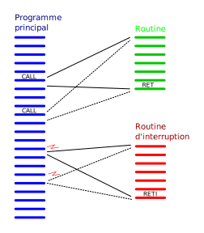
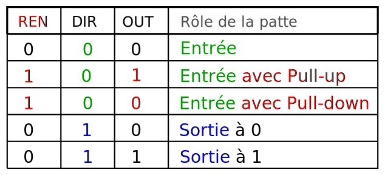

<!-- DIAPORAMA -->

<!-- Page de titre -->
<section class="page_de_garde">

Systèmes embarqués

Les interruptions du MSP430

Pierre-Yves Rochat

</section>

<!-- Page bienvenue plein écran-->
<section>
<h1 class="en_tete">Les interruptions du MSP430</h1>
<!-- def A -->
<!-- def A -->
<!-- def A -->

<!-- def A -->Systèmes embarqués | **Les interruptions du MSP430**
<!-- def A -->

<!-- A -->

Une interruption, c'est l’arrêt temporaire d’un programme au profit d’un autre, jugé à cet instant plus important.

</section>

<section>
<!-- A -->
<h1 class="en_tete">Evénement et routine</h1>

* Une interruption est caractérisée par un événement et une routine.

<!-- 2 -->

<!-- 2 -->* Le choix de l'événement est piloté par une logique,  spécifique à chaque interruption de chaque microcontrôleur.
<!-- 2 -->

<!-- 2 -->
</section>

<section>
<!-- A -->
<h1 class="en_tete">Vecteurs d’interruption sur un MSP430G</h1>

* 0xFFFE : Reset
* 0xFFFC : NMI
* 0xFFFA : Timer1 CCR0
* 0xFFF8 : Timer1 CCR1, CCR2, TAIFG
* 0xFFF6 : Comparator_A
* 0xFFF4 : Watchdog Timer
* 0xFFF2 : Timer0 CCR0
* 0xFFF0 : Timer0 CCR1, CCR2, TAIFG

* 0xFFEE : USCI status
* 0xFFEC : USCI receive/transmit
* 0xFFEA : ADC10
* 0xFFE8 : -
* 0xFFE6 : Port P2
* 0xFFE4 : Port P1

</section>

<section>
<!-- A -->
<h1 class="en_tete">Interruption sur une entrée</h1>

* **`P1DIR`** entrée ou sortie
* **`P1OUT`** valeur de sortie
* **`P1IN`** valeur des entrées *(lecture)*
* **`P1REN`** résistance de tirage *(pull-up ou pull-down)*

<!-- 2 -->
</section>

<section>
<!-- A -->
<h1 class="en_tete">Interruption sur une entrée</h1>

* **`P1DIR`** entrée ou sortie
* **`P1OUT`** valeur de sortie
* **`P1IN`** valeur des entrées *(lecture)*
* **`P1REN`** résistance de tirage *(pull-up ou pull-down)*

* **`P1IE`** *Interrupt Enable* : autorisation de l’interruption
* **`P1IES`** *Interrupt Edge Select* : choix du flanc
* **`P1IFG`** *Interrupt FlaG* : les **fanions d’interruption**

</section>

<section>
<!-- A -->
<h1 class="en_tete">Interruption sur une entrée</h1>

* **`P1IE`** *Interrupt Enable* : autorisation de l’interruption
* **`P1IES`** *Interrupt Edge Select* : choix du flanc
* **`P1IFG`** *Interrupt FlaG* : les **fanions d’interruption**

>
<!-- 2 -->
</section>

<section>
<!-- A -->
<h1 class="en_tete">Interruption sur une entrée</h1>

~~~~~~~~~~~~~~~~~~~~~~~~~~~~~~~~~~~~~~~~~~~~~~~~~~~~~~~ {.C  .numberLines}
 int main() {
   WDTCTL = WDTPW + WDTHOLD; // Stop watchdog timer
   P1DIR |= (1<<6); // Led verte en sortie
   P1OUT |= (1<<3); P1REN |= (1<<3); //pull-up sur l'entrée P1.3

   P1IES |= (1<<3); // Sur le flanc descendant
   P1IE |= (1<<3); // Interruption P1 activée sur le bit 3
   P1IFG &=~(1<<3); // Fanion d'interruption remis à zéro
   __enable_interrupt(); // General Interrupt Enable

   while(1) { // il n'y a rien à faire dans la boucle principale !
   }
 }

~~~~~~~~~~~~~~~~~~~~~~~~~~~~~~~~~~~~~~~~~~~~~~~~~~~~~~~~~~~~~~~~~~~~~~~~~~~~

</section>

<section>
<!-- A -->
<h1 class="en_tete">Interruption sur une entrée</h1>

~~~~~~~~~~~~~~~~~~~~~~~~~~~~~~~~~~~~~~~~~~~~~~~~~~~~~~~ {.C  .numberLines startFrom="14"}
 // Syntaxe spécifique pour les interruptions :

 // Routine d'interruption associée au Port P1
 #pragma vector=PORT1_VECTOR
 __interrupt void Port1_ISR(void) {

   // Fanion d'interruption correspondant au bit 3 remis à 0 :
   P1IFG &= ~(1<<3)

   P1OUT ^= (1<<6); // inverse P1.6 (LED verte)
 }

~~~~~~~~~~~~~~~~~~~~~~~~~~~~~~~~~~~~~~~~~~~~~~~~~~~~~~~~~~~~~~~~~~~~~~~~~~~~

</section>

<section>
<!-- A -->
<h1 class="en_tete">Interruption sur deux entrées, avec discrimination</h1>

~~~~~~~~~~~~~~~~~~~~~~~~~~~~~~~~~~~~~~~~~~~~~~~~~~~~~~~ {.C  .numberLines}
 int main() {
   ...
   P1IES &=~((1<<3)|(1<<4)); // Flancs montants
   P1IE |= (1<<3)|(1<<4); // Interruption activée sur 2 entrées
   P1IFG &=~((1<<3)|(1<<4)); // Fanions d'interruption remis à 0
   ...

 #pragma vector=PORT1_VECTOR
 __interrupt void Port1_ISR(void) {
   // discrimination des causes possible de l'interruption :
   if (P1IFG & (1<<3)) { P1IFG &= ~(1<<3); ... ;}
   if (P1IFG & (1<<4)) { P1IFG &= ~(1<<4); ... ;}
 }

~~~~~~~~~~~~~~~~~~~~~~~~~~~~~~~~~~~~~~~~~~~~~~~~~~~~~~~~~~~~~~~~~~~~~~~~~~~~

</section>

<!-- Page ADC, 2 parties -->
<section>
<!-- A -->
<h1 class="en_tete">Interruption sur une fin de conversion AD</h1>

~~~~~~~~~~~~~~~~~~~~~~~~~~~~~~~~~~~~~~~~~~~~~~~~~~~~~~~ {.C  .numberLines}
 int main() {
   WDTCTL = WDTPW + WDTHOLD; // Stop watchdog timer
   P1DIR |= (1<<6); P1OUT &=~(1<<6); // LED verte en sortie
   // Activation du convertisseur ADC 10 bits (ADC10) :
   ADC10CTL0 = ADC10SHT_2 + ADC10ON + ADC10IE; // Interrupt enable
   ADC10CTL1 = INCH_1; // Canal 1 = entrée A1 = P1.1
   ADC10AE0 |= (1<<1); // Autorisation de l'entrée A1
   __enable_interrupt(); // General Interrupt Enable
   ADC10CTL0 |= ENC + ADC10SC; // lance une première conversion

   while(1) { // il n'y a rien à faire dans la boucle principale !
   }
 }

~~~~~~~~~~~~~~~~~~~~~~~~~~~~~~~~~~~~~~~~~~~~~~~~~~~~~~~~~~~~~~~~~~~~~~~~~~~~

</section>

<section>
<!-- A -->
<h1 class="en_tete">Interruption sur une fin de conversion AD</h1>

~~~~~~~~~~~~~~~~~~~~~~~~~~~~~~~~~~~~~~~~~~~~~~~~~~~~~~~ {.C  .numberLines startFrom="14"}
 // Routine d'interruption associée à la fin de conversion ADC
 #pragma vector=ADC10_VECTOR
 __interrupt void ADC10_ISR(void) {

   uint16_t val = ADC10MEM; // lit le résultat de la conversion
   ADC10CTL0 |= ENC + ADC10SC; // lance la conversion suivante

   if (val > 511) { // La LED verte montre si la valeur dépasse Vcc/2
     P1OUT |= (1<<6); // LED verte On
   } else {
     P1OUT &=~(1<<6); // LED verte Off
   }
 }

~~~~~~~~~~~~~~~~~~~~~~~~~~~~~~~~~~~~~~~~~~~~~~~~~~~~~~~~~~~~~~~~~~~~~~~~~~~~

</section>

<section>
<!-- A -->
<h1 class="en_tete">Les interruptions du MSP430</h1>

* Registres pour le choix des événements
* Écriture d'une routine d'interruption
* Interruption sur un entrée
* Interruption de fin de conversion A/D 

*Suite :*

* Les timers
* Les timers du le MSP430

</section>

