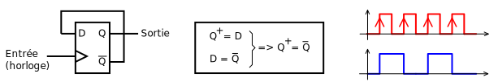
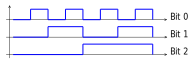
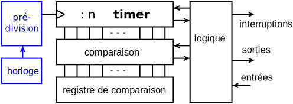
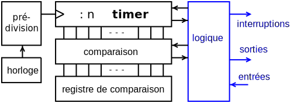
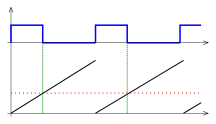

<!-- DIAPORAMA -->

<!-- Page de titre -->
<section class="page_de_garde">

Systèmes embarqués

Intruduction aux timers

Pierre-Yves Rochat

</section>

<section>
<!-- def A -->
<!-- def A -->
<!-- def A -->

<!-- def A -->Systèmes embarqués | **Intruduction aux timers**
<!-- def A -->

<!-- A -->
<h1 class="en_tete">Les timers</h1>

* Gérer le temps en jouant avec 

le temps d'exécution des instructions

est compliqué.

~~~~~~~~~~~~~~~~~~~~~~~~~~~~~~~~~~~~~~~~~~~~~~~~~~~~~~~ {.C  .numberLines startFrom="1"}
void AttenteMs (int duree) {
  volatile int j;
  int i;
  for (i=0; i<duree; i++) {
    for (j=0; j<BaseTempsMs; j++){
    }
  }
}
~~~~~~~~~~~~~~~~~~~~~~~~~~~~~~~~~~~~~~~~~~~~~~~~~~~~~~~~~~~~~~~~~~~~~~~~~~~~

</section>

<section>
<!-- A -->
<h1 class="en_tete">Gestion précise du temps</h1>

* Des circuits spécialisés vont nous aider.
<!-- 2 -->* Par exemple pour générer un PWM :

<!-- 2 -->
</section>

<section>
<!-- A -->
<h1 class="en_tete">Compteur binaire</h1>

* La base d'un timer est un compteur binaire :

<!-- 23 -->
<!-- 3 -->
</section>

<section>
<!-- A -->
<h1 class="en_tete">Les timers</h1>

</section>

<section>
<!-- A -->
<h1 class="en_tete">Prédivision</h1>

</section>

<section>
<!-- A -->
<h1 class="en_tete">Logique de gestion</h1>

</section>

<section>
<!-- A -->
<h1 class="en_tete">Registres de comparaison</h1>

</section>

<section>
<!-- A -->
<h1 class="en_tete">Les timers des microcontrôleurs</h1>

* Intel 8253 comme complément aux microprocesseurs

* Le timer très simple des premiers PIC
* Les AVR et leurs timers 8 et 16 bits
* Les timers 16 bits des MSP430
* Des timers 32 bits complexes sur les ARM

</section>

<section>
<!-- A -->
<h1 class="en_tete">Les interruptions associées aux timers</h1>

* Les timers deviennent intéressant lorsqu'ils sont associés à des interruptions
<!-- 234 -->* Une interruption peut être générée au dépassement de capacité du compteur
<!-- 34 -->* Des interruptions peuvent se produire par les registres de comparaison
<!-- 4 -->* Bien d'autres modes sont disponibles

</section>

<section>
<!-- A -->
<h1 class="en_tete">PWM par interruption</h1>

</section>

<section>
<!-- A -->
<h1 class="en_tete">Les timers</h1>

* Les timers aident à gérer le temps
* Prédivision, logique de gestion
* Registres de comparaison

*Suite :*

* Mise en œuvre : exemple du MSP430

</section>

