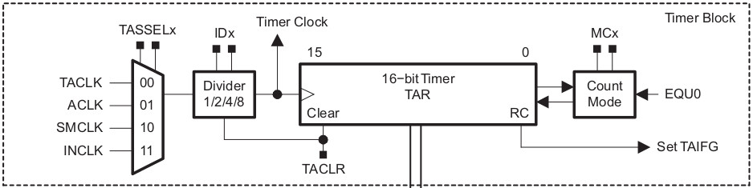
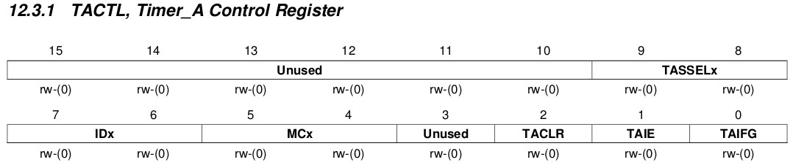
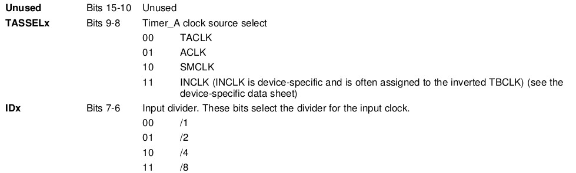
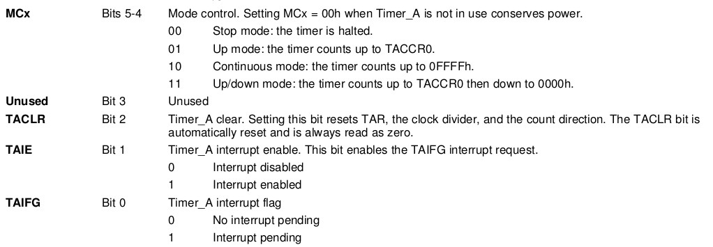
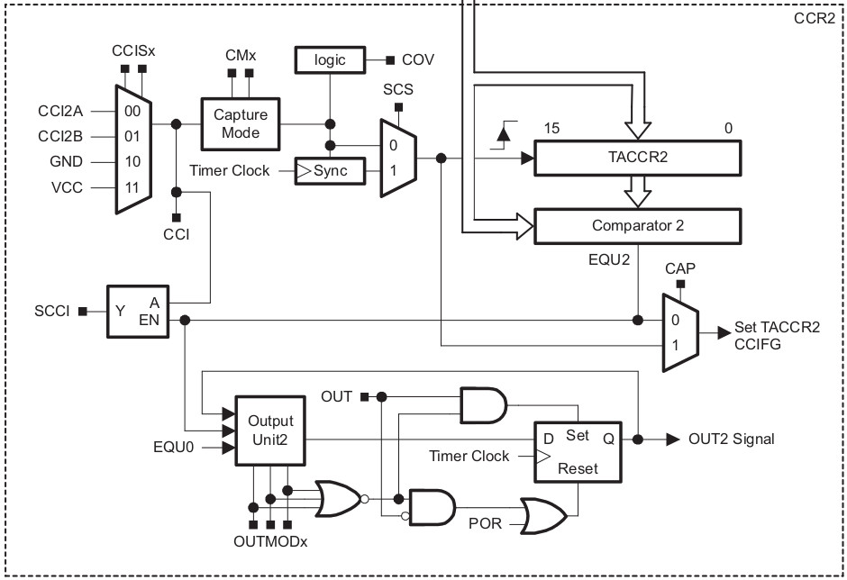
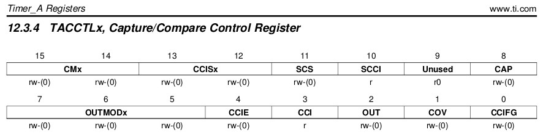
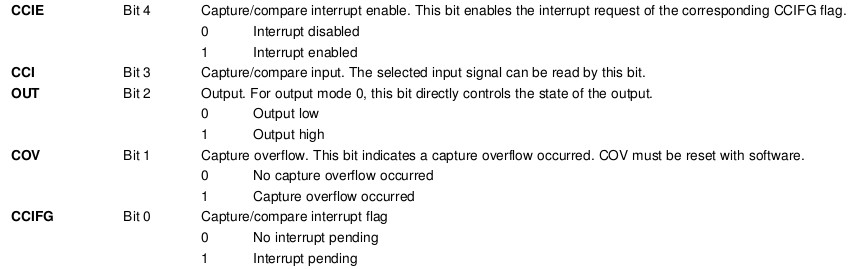

<!-- DIAPORAMA -->

<!-- Page de titre -->
<section class="page_de_garde">

Systèmes embarqués

Les timers du MSP430

Pierre-Yves Rochat

</section>

<!-- Page bienvenue plein écran-->
<section>
<h1 class="en_tete">Introduction aux interruptions</h1>
<!-- def A -->
<!-- def A -->
<!-- def A -->

<!-- def A -->Systèmes embarqués | **Les timers du MSP430**
<!-- def A -->

<!-- A -->

Pierre-Yves Rochat

</section>

<!-- Page bienvenue, demi-->
<section>
<!-- A -->
<h1 class="en_tete">Les timers</h1>

* Gestion du temps

* Timers, prédivision, logique de gestion 

et registres de comparaison

* Mise en œuvre : exemple du MSP430

* Interruptions des timers

</section>

<section>
<!-- A -->
<h1 class="en_tete">Le timer A du MSP430</h1>

</section>

<section>
<!-- A -->
<h1 class="en_tete">Le registre de contrôle</h1>

</section>

<section>
<h1 class="en_tete">Le registre de contrôle</h1>

<!-- A -->
</section>

<section>
<!-- A -->
<h1 class="en_tete">Programme de mise en oeuvre</h1>

~~~~~~~~~~~~~~~~~~~~~~~~~~~~~~~~~~~~~~~~~~~~~~~~~~~~~~~ {.C  .numberLines startFrom="1"}
int main() {
  WDTCTL = WDTPW + WDTHOLD; // Watchdog hors service
  BCSCTL1 = CALBC1_1MHZ;
  DCOCTL = CALDCO_1MHZ;     // Fréquence CPU
  P1DIR |= (1<<0); // P1.0 en sortie pour la LED
  TACTL0 = TASSEL_2 + ID_3 + MC_2;
  while (1) {               // Boucle infinie
    if (TACTL0 & TAIFG) {
      TACTL0 &= ~TAIFG;
      P1OUT ^= (1<<0);      // Inversion LED
    }
  }
}

~~~~~~~~~~~~~~~~~~~~~~~~~~~~~~~~~~~~~~~~~~~~~~~~~~~~~~~~~~~~~~~~~~~~~~~~~~~~

</section>

<section>
<!-- A -->
<h1 class="en_tete">Les registres de comparaison</h1>

</section>

<section>
<!-- A -->
<h1 class="en_tete">Les registres de comparaison</h1>

</section>

<section>
<!-- A -->
<h1 class="en_tete">Les registres de comparaison</h1>

~~~~~~~~~~~~~~~~~~~~~~~~~~~~~~~~~~~~~~~~~~~~~~~~~~~~~~~ {.C  .numberLines startFrom="14"}
int main() {
  ...
  TACCR0 = 62500; // 62500 * 8 us = 500 ms
  while (1) {     // Boucle infinie
    if (TACCTL0 & CCIFG) {
      TACCTL0 &= ~CCIFG;
      TACCR0 += 62500;
      P1OUT ^= (1<<0); // Inversion LED
    }
  }
}

~~~~~~~~~~~~~~~~~~~~~~~~~~~~~~~~~~~~~~~~~~~~~~~~~~~~~~~~~~~~~~~~~~~~~~~~~~~~

</section>

<section>
<!-- A -->
<h1 class="en_tete">L'interruptions de dépassement de capacité</h1>

~~~~~~~~~~~~~~~~~~~~~~~~~~~~~~~~~~~~~~~~~~~~~~~~~~~~~~~ {.C  .numberLines startFrom="14"}
int main() {
  ...
  TACTL |= TAIE; // Interruption de l'overflow
  _BIS_SR (GIE); // Autorisation générale des interruptions
  while (1) {    // Boucle infinie vide
  }
}
// Timer_A1 Interrupt Vector (TAIV) handler
#pragma vector=TIMER0_A1_VECTOR
__interrupt void Timer_A1 (void) {
  switch (TAIV) {    // discrimination des sources d'interruption
  case  2:           // CCR1 : not used
    break;
  case  4:           // CCR2 : not used
    break;
  case 10:           // Overflow
    P1OUT ^= (1<<0); // Inversion LED
    break;
  }
}
~~~~~~~~~~~~~~~~~~~~~~~~~~~~~~~~~~~~~~~~~~~~~~~~~~~~~~~~~~~~~~~~~~~~~~~~~~~~

</section>

<section>
<!-- A -->
<h1 class="en_tete">L'interruption de comparaison</h1>

~~~~~~~~~~~~~~~~~~~~~~~~~~~~~~~~~~~~~~~~~~~~~~~~~~~~~~~ {.C  .numberLines startFrom="14"}
int main() {
  ...
  TACCTL0 |= CCIE; // Interruption de la comparaison
  _BIS_SR (GIE);   // Autorisation générale des interruptions
  while (1) {      // Boucle infinie vide
  }
}
#pragma vector=TIMER0_A0_VECTOR
__interrupt void Timer_A0 (void) {
  CCR0 += 62500;
  P1OUT ^= (1<<0); // Inversion LED
}

~~~~~~~~~~~~~~~~~~~~~~~~~~~~~~~~~~~~~~~~~~~~~~~~~~~~~~~~~~~~~~~~~~~~~~~~~~~~

</section>

<section>
<!-- A -->
<h1 class="en_tete">PWM par interruption</h1>

~~~~~~~~~~~~~~~~~~~~~~~~~~~~~~~~~~~~~~~~~~~~~~~~~~~~~~~ {.C  .numberLines startFrom="14"}
int main() {
  ...
  TACTL |= TAIE;   // Interruption de l'overflow
  TACCTL0 |= CCIE; // Interruption de la comparaison
  _BIS_SR (GIE);   // Autorisation générale des interruptions
  while (1) {      // Boucle infinie vide
  }
}
#pragma vector=TIMER0_A1_VECTOR
__interrupt void Timer_A1 (void) {
  switch (TAIV) {    // discrimination des sources d'interruption
  case  2:           // CCR1 : not used
    break;
  case  4:           // CCR2 : not used
    break;
  case 10:           // Overflow
    P1OUT |= (1<<0); // Activer le signal au début du cycle
    break;
  }
}
#pragma vector=TIMER0_A0_VECTOR
__interrupt void Timer_A0 (void) {
  P1OUT &=~(1<<0); // Désactiver le signal au moment donné 
}                  // par le registre de comparaison
~~~~~~~~~~~~~~~~~~~~~~~~~~~~~~~~~~~~~~~~~~~~~~~~~~~~~~~~~~~~~~~~~~~~~~~~~~~~

</section>

<section>
<!-- A -->
<h1 class="en_tete">Les timers</h1>

* Gestion du temps

* Timers, prédivision, logique de gestion 

et registres de comparaison

* Mise en œuvre : exemple du MSP430

* Interruptions des timers

</section>

