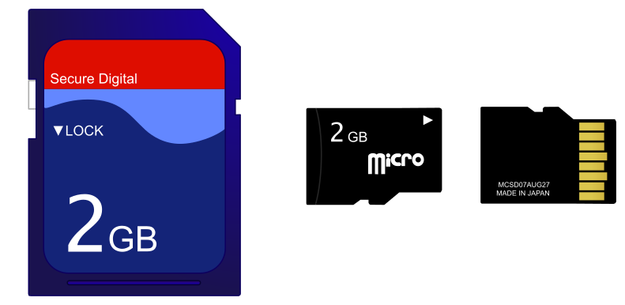
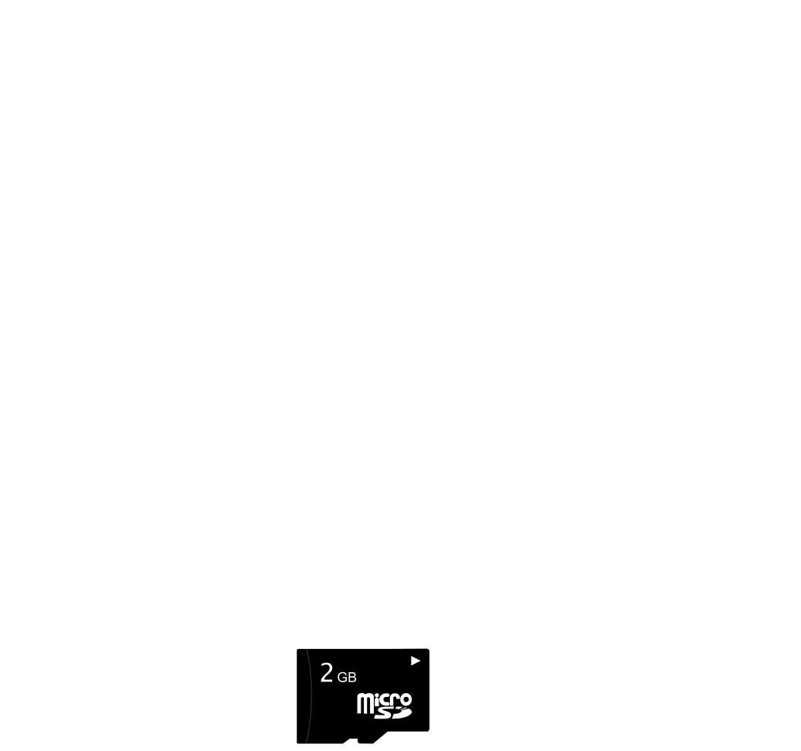

<!-- DIAPORAMA -->

<section class="page_de_garde">

Systèmes embarqués

Mémoires permanentes pour les microcontrôleurs

Pierre-Yves Rochat

</section>

<section>
<h1 class="en_tete">Mémoires permanentes pour les microcontrôleurs</h1>
<!-- def A -->
<!-- def A -->
<!-- def A -->

<!-- def A -->Systèmes embarqués | **Mémoires permanentes pour les microcontrôleurs**
<!-- def A -->

<!-- A -->

Pierre-Yves Rochat

</section>

<section>
<!-- A -->
<h1 class="en_tete">Types de mémoires</h1>

* Principalement deux mémoires dans un microcontrôleur :

<!-- 234 -->

<!-- 234 -->`1.` Mémoire Flash, pour les programmes 
<!-- 34 -->`2.` Mémoire vive (RAM) pour les données
<!-- 234 -->

<!-- 4 -->

<!-- 4 -->* Comment conserver des données ?  Par exemple des paramètres de fonctionnement du système,  des compteurs d'utilisation, etc.
<!-- 4 -->

</section>

<section>
<!-- A -->
<h1 class="en_tete">EEPROM</h1>

* Certains microcontrôleurs disposent d’une mémoire du type EEPROM
 *Electrically-Erasable Programmable Read-Only Memory*
  
<!-- 23 -->* Par exemple, l’ATmega328  dispose de 1 kB d’EEPROM

<!-- 3 -->
</section>

<section>
<!-- A -->
<h1 class="en_tete">EEPROM : programmation</h1>

~~~~~~~ { .c .numberLines startFrom="1" }
  // Lecture en EEPROM :
  EEAR = adresse; // l'adresse est donnée
  EECR = (1<<EERE); // le fanion de lecture est activé
  valeur = EEDR; // lecture de la valeur

  // Ecriture en EEPROM :
  while (EECR & (1<<EEPE)) {} // attente de la fin d'une éventuelle écriture précédente
  EEAR = adresse; // l'adresse est donnée
  EEDR = valeur; // la valeur est donnée
  EECR = (1<<EEMPE); // autorise une écriture (Master Write Enable)
  EECR = (1<<EEPE); // lance le cycle d'écriture (Write Enable)
~~~~~~~
<!-- retour au mode normal pour l'éditeur -->

</section>

<section>
<!-- A -->
<h1 class="en_tete">FLASH</h1>

* Il est généralement possible d’accéder à la mémoire flash d’un microcontrôleur
<!-- 234 --> ... en faisant attention à ne pas détruire le programme !
<!-- 34 -->  
<!-- 34 -->* C’est un peu plus difficile sur des microcontrôleurs dont l’architecture n’est pas du type Von Neumann
<!-- 4 -->  
<!-- 4 -->* Dans tous les cas, l’effacement s’effectue par bloc

</section>

<section>
<!-- A -->
<h1 class="en_tete">FLASH : programmation</h1>

~~~~~~~ { .c .numberLines startFrom="1" }
  // Lecture en Flash :
  uint8_t *pointeur; // pointeur dans la Flash
  pointeur = (uint8_t *) 0x1040; //place l'adresse dans le pointeur
  uint8_t valeur = *pointeur;

  // Ecriture en Flash :
  FCTL3 = FWKEY; // Clear Lock bit
  *pointeur = valeur; // écrit la valeur dans la Flash
  FCTL3 = FWKEY + LOCK; // Set LOCK bit

  // Effacement d'un bloc de la mémoire Flash
  FCTL1 = FWKEY + ERASE; // Set Erase bit
  FCTL3 = FWKEY; // Clear Lock bit
  *pointeur = 0; // lance un cycle d'effacement du bloc, la valeur donnée n'a pas d'importance
  FCTL3 = FWKEY + LOCK; // Set LOCK bit
  FCTL1 = FWKEY; // Clear WRT bit
~~~~~~~
<!-- retour au mode normal pour l'éditeur -->

</section>

<section>
<!-- A -->
<h1 class="en_tete">Limite du nombre de cycles d’écriture</h1>

* Pour chaque type de mémoire non-volatile, un nombre de cycles limité
<!-- 23 -->* Typiquement 10’000 pour une FLASH
<!-- 3 -->* 100’000 pour une EEPROM

</section>

<section>
<!-- A -->
<h1 class="en_tete">Mémoires externes</h1>
<!-- Contenu : -->

* Il est possible d’ajouter des mémoires non-volatiles externes :
<!-- 234 -->* RAM secourues
<!-- 34 -->* EEPROM série (I2C ou SPI)

<!-- 4 -->

</section>

<section>
<!-- A -->
<h1 class="en_tete">Mémoires externes</h1>
<!-- Contenu : -->

* Il est possible d’ajouter des mémoires non-volatiles externes :
* RAM secourues
* EEPROM série
* Cartes SD

<!-- 2 -->
</section>

<section>
<!-- A -->
<h1 class="en_tete">Système de fichier</h1>

* Compliqué de gérer les données d’une carte SD
<!-- 234 -->* Pratique d’utiliser un système de fichier : par exemple FAT 32
<!-- 34 -->* Des librairies sont disponibles
<!-- 4 --> PetitFat :
<!-- 4 -->

<!-- 4 -->

<!-- 4 -->  
<!-- 4 -->*Procédure* 
<!-- 4 -->`pf_mount:` 
<!-- 4 -->`pf_open:` 
<!-- 4 -->`pf_read:` 
<!-- 4 -->`pf_write:` 
<!-- 4 -->`pf_lseek:` 
<!-- 4 -->`pf_opendir:` 
<!-- 4 -->`pf_readdir:`
<!-- 4 -->

<!-- 4 -->

<!-- 4 -->  
<!-- 4 -->*Rôle* 
<!-- 4 -->`Monter un volume` 
<!-- 4 -->`Ouvrir un fichier` 
<!-- 4 -->`Lire des données dans un fichier` 
<!-- 4 -->`Écrire des données dans un fichier` 
<!-- 4 -->`Déplacer le pointeur de lecture ou d’écriture` 
<!-- 4 -->`Ouvrir un dossier` 
<!-- 4 -->`Lire le contenu d’un dossier`

</section>

<section>
<!-- A -->
<h1 class="en_tete">Mémoires permanentes pour les microcontrôleurs</h1>

* RAM : non-volatile
* EEPROM
* Mémoires Flash
* Mémoires externes

</section>

