<!-- DIAPORAMA -->

<section class="page_de_garde">

Systèmes embarqués

Montage du robot

Pierre-Yves Rochat

</section>

<section>
<!-- def A -->
<!-- def A -->
<!-- def A -->

<!-- def A -->Systèmes embarqués | **Montage du robot**
<!-- def A -->

<!-- A -->
<h1 class="en_tete">Base et vis de fixation des moteurs</h1>
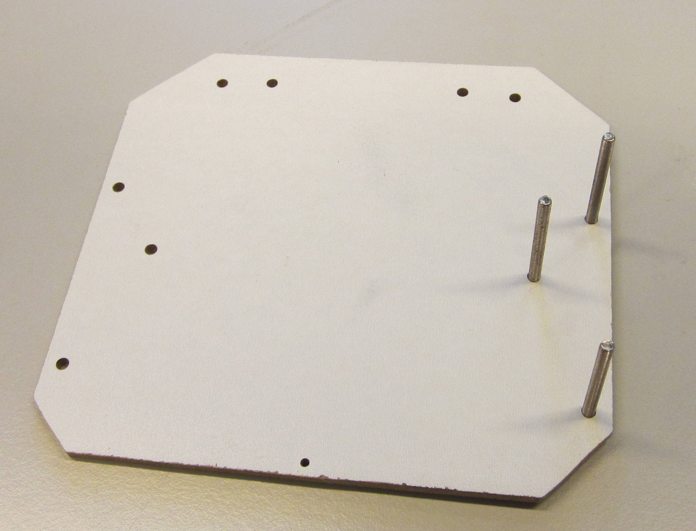
</section>

<section>
<!-- A -->
<h1 class="en_tete">Fixation des moteurs</h1>
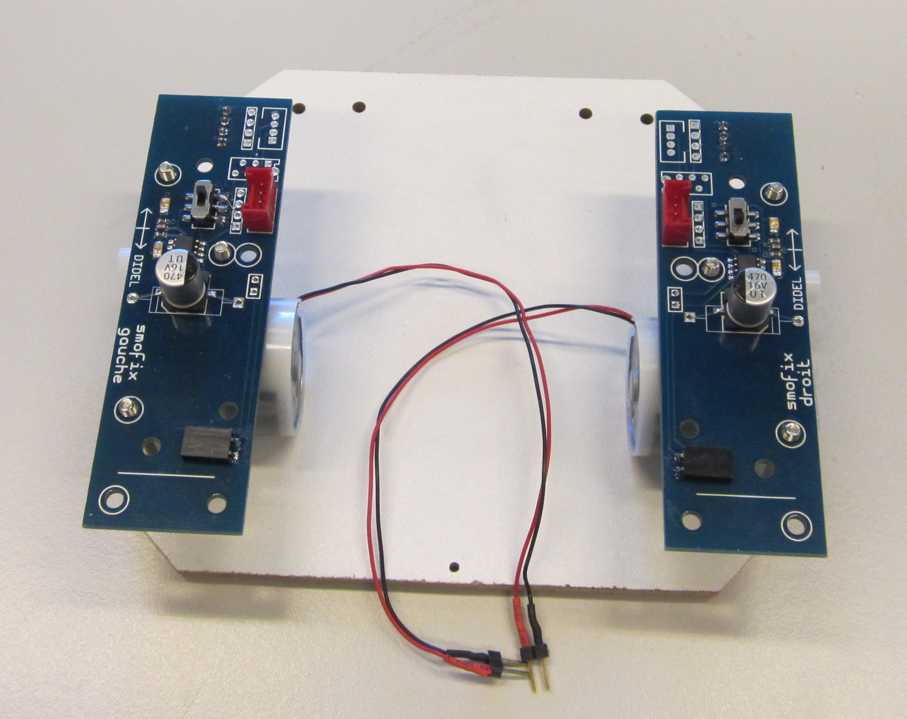
</section>

<section>
<!-- A -->
<h1 class="en_tete">Fils des moteurs : noir (-) rouge (+)</h1>
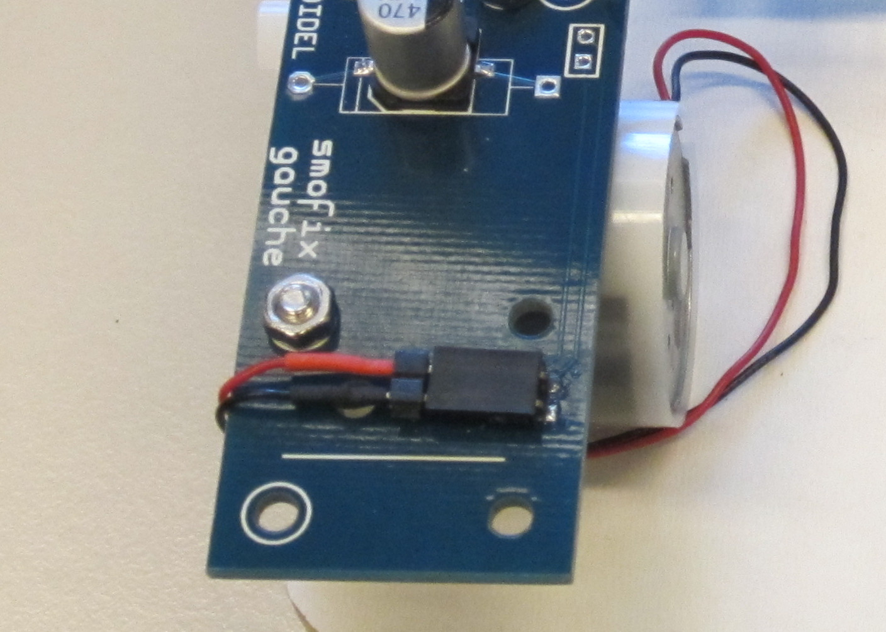
</section>

<section>
<!-- A -->
<h1 class="en_tete">Carte microcontrôleur MSP430G2553</h1>
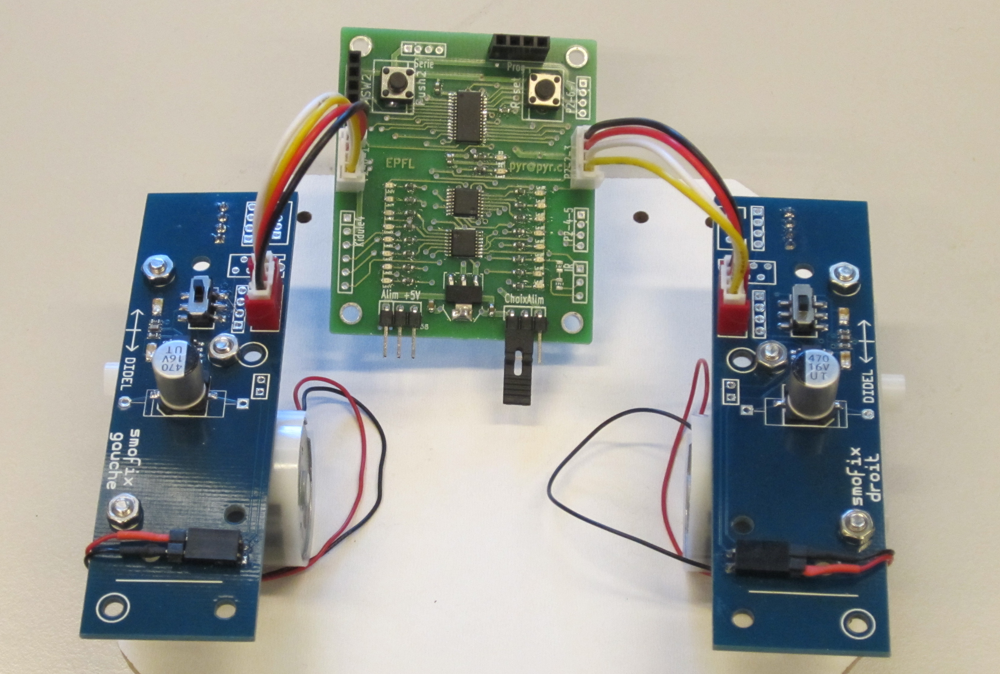

(SMD = monté en surface)

</section>

<section>
<!-- A -->
<h1 class="en_tete">Balcaster</h1>
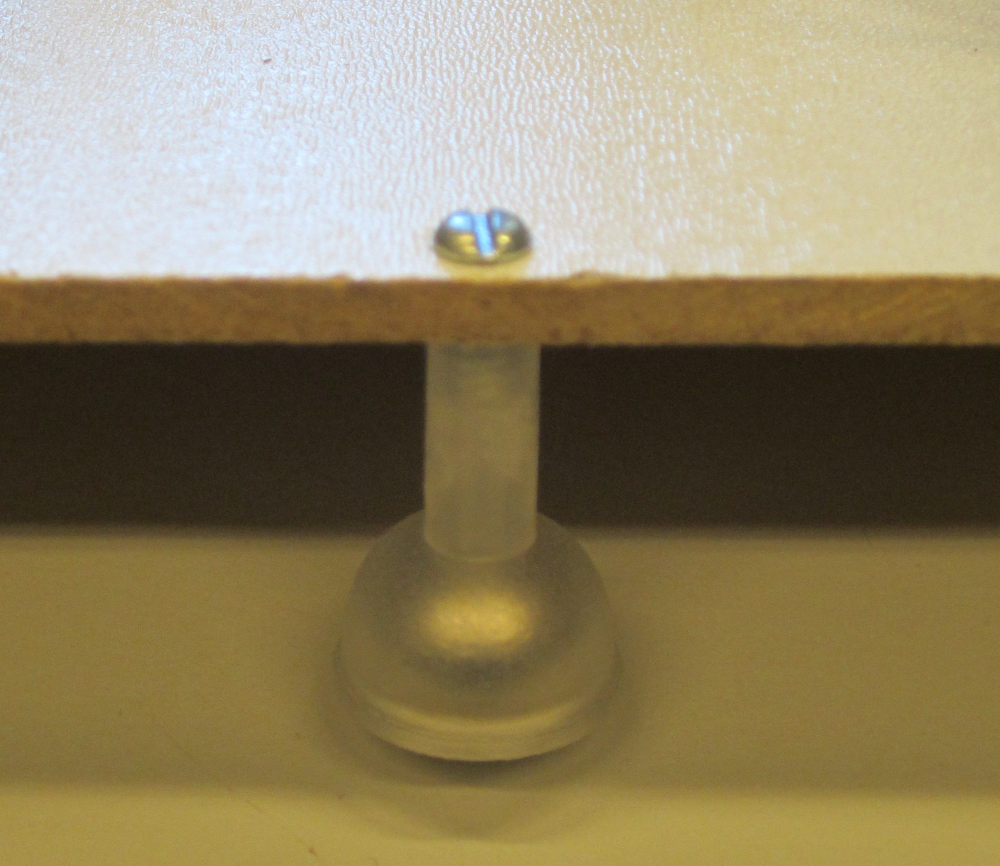
</section>

<section>
<!-- A -->
<h1 class="en_tete">Entretoises</h1>
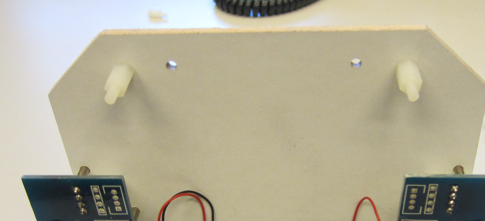
</section>

<section>
<!-- A -->
<h1 class="en_tete">Capteurs de distance IR</h1>
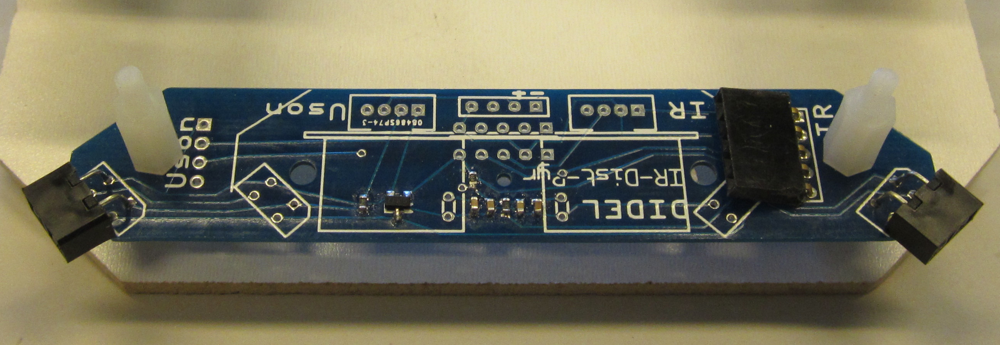
</section>

<section>
<!-- A -->
<h1 class="en_tete">Connection capteurs de distance IR</h1>

</section>

<section>
<!-- A -->
<h1 class="en_tete">Roues</h1>

</section>

<section>
<!-- A -->
<h1 class="en_tete">Alimentation de la carte (Gnd, +5V)</h1>
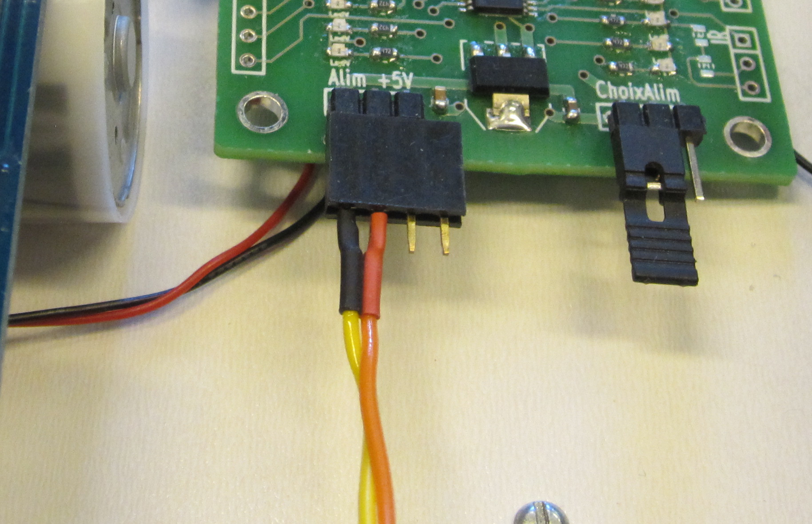
</section>

<section>
<!-- A -->
<h1 class="en_tete">Robot complet</h1>
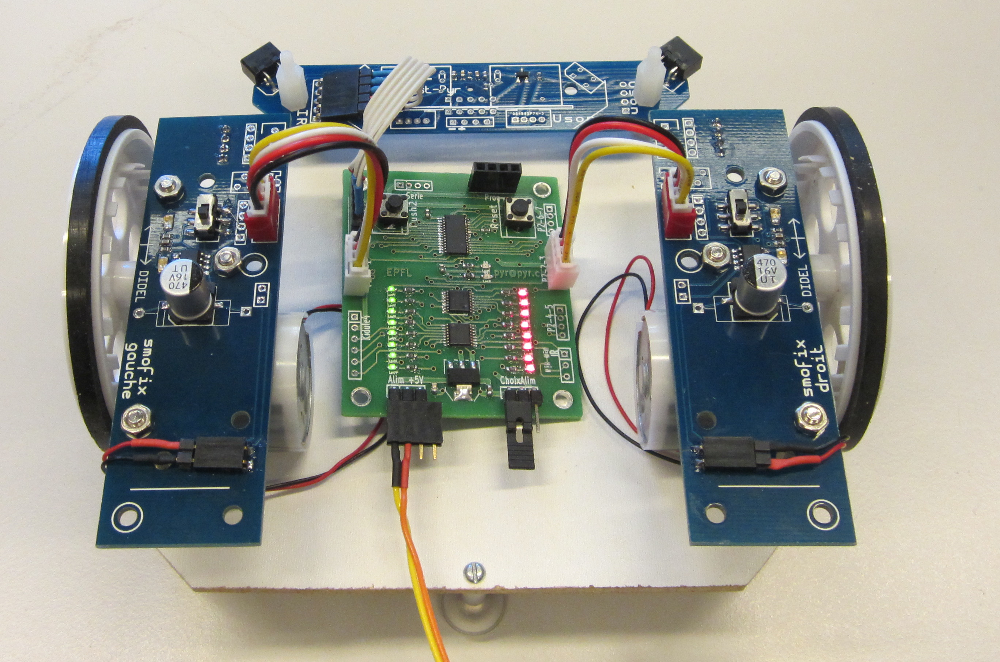
</section>

<section>
<!-- A -->
<h1 class="en_tete">Robot complet</h1>
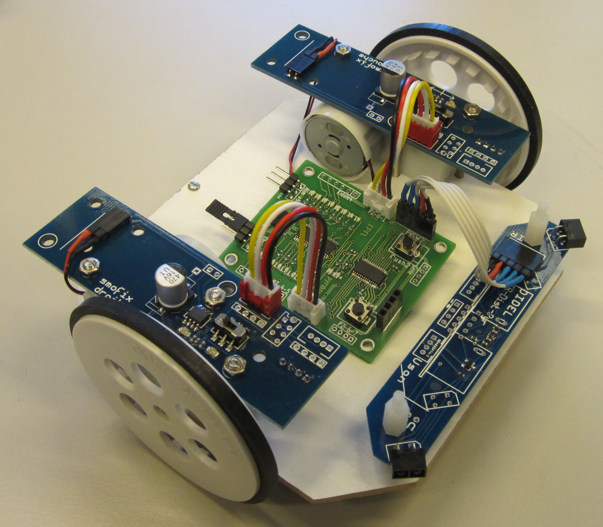
</section>

<section>
<!-- A -->
<h1 class="en_tete">Programation par le Launchpad</h1>
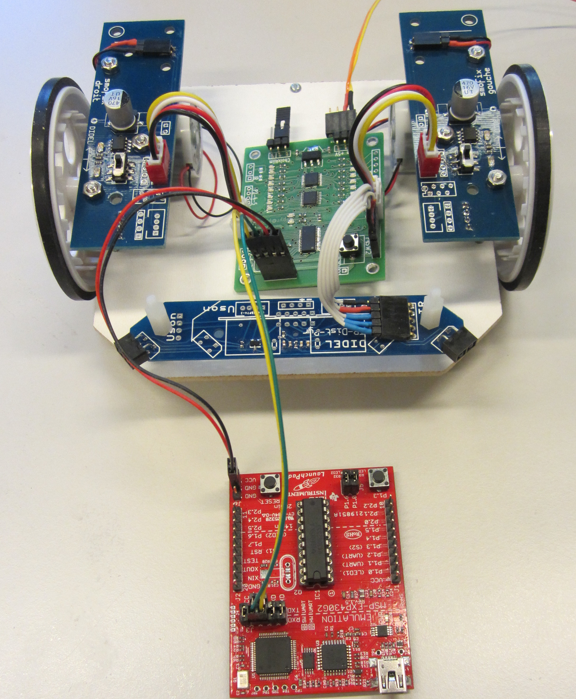
</section>

