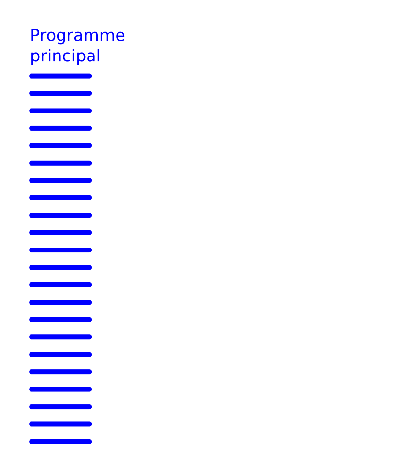
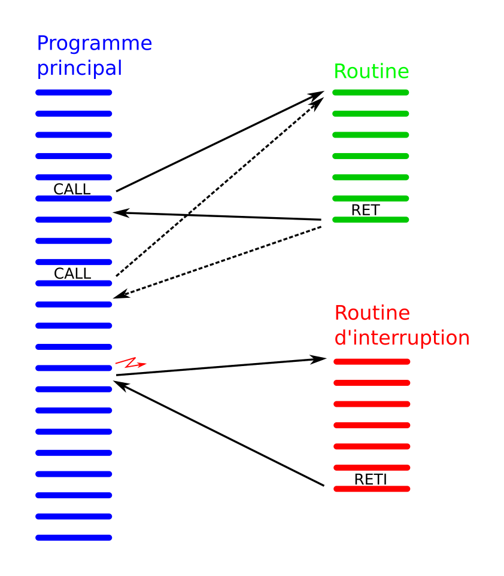

<!-- DIAPORAMA -->

<!-- Page de titre -->
<section class="page_de_garde">

SMUG 2016

Des MOOCs pour l'Afrique

Pierre-Yves Rochat

</section>

<section>
<!-- def A -->
<!-- def A -->
<!-- def A -->

<!-- def A -->SMUG 2016 | **Des MOOCs pour l'Afrique**
<!-- def A -->

<!-- A -->
<h1 class="en_tete">De 1970 à 1997</h1>

* 1970 : les clubs d'électronique
<!-- 23456 -->* 1975 : fondation d'Epsilon-system et de Microclub
<!-- 3456 -->* 1980 : fin de mes études à l'EPFL et Bureau d'Ingénieur Pierre-Yves Rochat
<!-- 456 -->* Engagement de David Besuchet, d'Yves Raboud et de Pascal Zweilin
<!-- 56 -->* Travaux pour des stations d'épurations, pour des orthodontistes, etc

<!-- 6 -->

<!-- 6 -->* 1997 : après les Smaky, quelle direction prendre ?
<!-- 6 -->

</section>

<section>
<!-- A -->
<h1 class="en_tete">Premiers pas en Afrique</h1>

* 1997 : voyage en famille au Togo
<!-- 23456 -->* Envoi de matériel informatique usagé vers l'Afrique
<!-- 3456 -->* Enseignement de la *maintenance informatique*

<!-- 456 -->

<!-- 456 -->* Dominique s'investit à Bassar
<!-- 56 -->* Elle fonde **Le Petit Prince** 
<!-- 6 -->* Une courte maladies'emporte en 2008 
<!-- 456 -->

<!-- 6 -->
</section>

<section>
<!-- A -->
<h1 class="en_tete">La vie continue...</h1>

* Andyl et Steicy

<!-- 2 -->

<!-- 2 -->* Raphaël est né samedi dernier
<!-- 2 -->

<!-- 2 -->
</section>

<section>
<!-- A -->
<h1 class="en_tete">Les microcontrôleurs</h1>

* 2006 : après le maintenance informatique, les **Microcontrôleurs**
<!-- 234 -->* Enseignement dans des universités de 12 pays africains
<!-- 34 -->* Des **kits** de développement adaptés à l'Afrique (AVR, puis MSP430)
<!-- 4 -->* Développement d'enseignes et afficheur à LED

<!-- 34 -->
<!-- 4 -->
</section>

<section>
<!-- A -->
<h1 class="en_tete">Un MOOC pour l'Afrique ?</h1>

* Janvier 2013, l'EPFL me contacte...
<!-- 234 -->* Octobre 2013 : **Comprendre les microcontrôleurs**, sur Coursera.org
<!-- 34 -->* 5 sessions, 37'000 inscriptions
<!-- 4 -->* 100'000 devoirs corrigés
<!-- 234 -->

<!-- 34 -->
<!-- 4 -->
</section>

<section>
<!-- A -->
<h1 class="en_tete">Un MOOC en préparation</h1>

* Enseignes et afficheurs à LED
<!-- 234 -->* MOOC collaboratif avec trois professeurs africains
<!-- 34 -->* Studio d'enregistrement en Côte d'Ivoire
<!-- 4 -->* Sortie en septembre 2016 ?
<!-- 234 -->

</section>

<section>
<!-- A -->
<h1 class="en_tete">Définition</h1>

On appelle interruption l’arrêt temporaire d’un programme au profit d’un autre programme, jugé à cet instant plus important.

<!-- 23456 -->

<!-- 23456 -->Dans la vie courante :
<!-- 23456 -->

<!-- 3456 -->

<!-- 3456 -->* Je suis en train de travailler
<!-- 456 -->* Le téléphone sonne
<!-- 56 -->* Je vais répondre au téléphone
<!-- 6 -->* Après la conversation, je reprends mon travail là où je l’avais laissé.
<!-- 3456 -->

<!-- 3456 -->
<!-- 456 -->
<!-- 56 -->
<!-- 6 -->
</section>

<section>
<!-- A -->
<h1 class="en_tete">Procédure ou fonction</h1>

<!-- 2 -->
<!-- 3 -->
<!-- 4 -->
</section>

<section>
<!-- A -->
<h1 class="en_tete">Routine d’interruption</h1>

<!-- 2 -->
<!-- 3 -->
</section>

<section>
<!-- A -->
<h1 class="en_tete">Étapes pour mettre en œuvre une interruption</h1>

* Autoriser l’interruption qui nous intéresse
* Préciser comment cette interruption doit fonctionner
* Autoriser globalement les interruptions
* ... et écrire la routine d'interruption !

</section>

<section>
<!-- A -->
<h1 class="en_tete">Un grand MERCI</h1>

* Un grand **MERCI** à Jean-Daniel et à Mme Nicoud !

</section>

